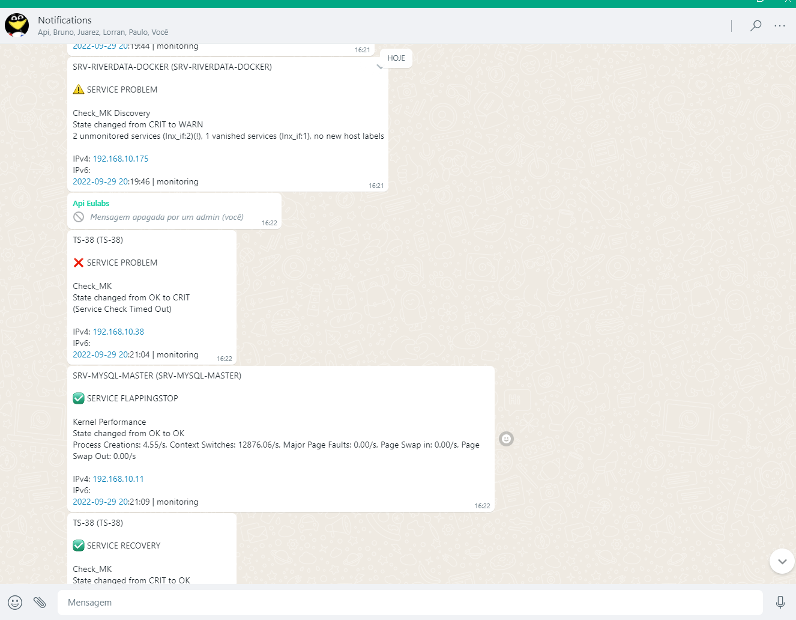

# Checkmk WhatsApp notification

<br>

<div align="center">

</div>

<br>
<div align="center">
 —  — 
</div>
<br>

A Checkmk notification plugin that delivers host and service alerts as WhatsApp
messages through the [WaAPI](https://waapi.app) REST API. One shell script, no
dependencies beyond `bash` and `curl`.

## COMPATIBILITY

- Checkmk 2.4 (Raw / Enterprise)
- Checkmk 2.3, 2.2, 2.1
- Checkmk 1.6 (legacy, still works)

The plugin only reads the `NOTIFY_*` environment variables that Checkmk has
exposed to notification scripts since 1.2, so newer releases are expected to
work unchanged.

Requires `bash` 4.x or newer and `curl` — both present on every OMD site.

## EXAMPLE

Notifications are usually sent to a WhatsApp group. Here is how a notification
is structured:



## REQUIREMENTS

To send alerts from Checkmk to WhatsApp you need:

* a [waapi.app](https://waapi.app) account
* a WaAPI API token
* a WaAPI instance ID, connected to your number
* the destination chat ID in the proper format:
  * `<phone>@c.us` — individual chat, e.g. `4915112345678@c.us`
  * `<group-id>@g.us` — group chat
  * `<channel-id>@newsletter` — channel

### Creating the API token

1. Create an account at [waapi.app](https://waapi.app).
2. Go to [waapi.app/user/api-tokens](https://waapi.app/user/api-tokens) and
   generate a token with all scopes (read, update, create, delete).
3. Create an instance and connect it to your number by scanning the QR code.

## INSTALLATION

### Option A — MKP package (recommended)

Download `whatsapp_notify-<version>.mkp` from the
[latest release](https://github.com/WaAPIapp/check_mk-whatsapp-notify/releases/latest)
and install it as the site user:

```bash
su - mysite
mkp add whatsapp_notify-2.0.1.mkp
mkp enable whatsapp_notify 2.0.1
```

Or upload it in the GUI under **Setup → Maintenance → Extension packages**.

### Option B — single script

Switch to your Checkmk site user:

```bash
su - mysite
```

Create the local notification directory if it does not exist yet, and change
into it:

```bash
mkdir -p ~/local/share/check_mk/notifications/
cd ~/local/share/check_mk/notifications/
```

Download the script:

```bash
curl -fLo check_mk_whatsapp-notify.sh \
  https://raw.githubusercontent.com/WaAPIapp/check_mk-whatsapp-notify/master/check_mk_whatsapp-notify.sh
```

Make it executable:

```bash
chmod +x check_mk_whatsapp-notify.sh
```

> Do **not** `git clone` the repository into the notifications directory —
> Checkmk scans that directory and every extra file ends up in the notification
> method dropdown.

### Verify the setup before wiring it into Checkmk

```bash
./check_mk_whatsapp-notify.sh --test <instance-id> <chat-id> <api-token>
```

On success the script prints a confirmation and a test message arrives in the
chat. On failure it prints the exact reason (bad token, unknown instance,
instance not connected, …) and exits with code `2`.

## CHECKMK CONFIGURATION

Create the notification rule under:

```
Setup → Events → Notifications
```

The quickest way is to clone your existing mail notification rule, then:

* change the description, e.g. *Notify all contacts of a host/service via WhatsApp*
* set the notification method to **Push Notification (using WhatsApp with waapi.app)**
* select **Call with the following parameters:**

| # | Parameter | Example |
|---|---|---|
| 1 | WaAPI instance ID | `123` |
| 2 | Destination chat ID | `4915112345678@c.us` or `12036...@g.us` |
| 3 | WaAPI API token | `abc123mytokenxyz789` |
| 4 | API base URL *(optional)* | `https://waapi.app/api/v1` |

Parameter 4 only needs to be set if you point the plugin at a different API
endpoint. If you would rather keep the token out of the rule configuration, set
`WAAPI_API_TOKEN` in the site environment (`~/etc/environment`) and leave
parameter 3 empty.

Test the rule with **Setup → Events → Notifications → Analyse** or by forcing a
notification on a test host.

## MESSAGE FORMAT

```
srv01 (Web frontend, production)

❌ SERVICE PROBLEM

Filesystem /var
State changed from OK to CRIT
CRIT - 95.2% used (47.6 of 50.0 GB)

IPv4: 10.0.0.5

2026-09-04 16:04 | mysite
```

State icons: ✅ OK/UP · ⚠️ WARN · ❌ CRIT/DOWN · ⁉️ UNREACH · ❓ anything else.

## TROUBLESHOOTING

The script writes a specific error to stderr and exits `2` on every failure, so
`~/var/log/notify.log` on the site tells you what went wrong:

| Message | Cause |
|---|---|
| `no WaAPI instance ID given` | Parameter 1 empty in the notification rule |
| `is not a valid chat ID` | Chat ID is missing the `@c.us` / `@g.us` / `@newsletter` suffix |
| `WaAPI rejected the API token (HTTP 401)` | Token wrong, expired, or missing scopes |
| `WaAPI instance <n> not found (HTTP 404)` | Wrong instance ID, or the instance belongs to another account |
| `accepted the request but did not send the message` | Instance is not connected — rescan the QR code |
| `curl failed with exit code 28` | Timeout — the site cannot reach `waapi.app` (firewall/proxy) |

## CHANGELOG

### 2026-09 — v2.0.1

* **Fixed:** the Checkmk Exchange rejected the package with "The description
  field has invalid content". The manifest description now uses only the
  character set that accepted packages use, and `build-mkp.py` enforces it at
  build time.

### 2026-09 — v2.0

* **Fixed:** service output containing `"`, `\` or newlines produced a malformed
  JSON body and the notification was silently dropped. All values are now
  properly JSON-escaped.
* **Fixed:** the script reported success to Checkmk whenever `curl` itself ran,
  even on HTTP 401/404/500 or an application-level `{"status":"error"}` answer.
  Failed notifications now exit `2` with a specific reason, so Checkmk retries
  and records them.
* **Fixed:** the `UNKN` state rendered as the literal text `U+1F612` instead of
  an icon, and there was no fallback for unrecognised states.
* **Fixed:** unquoted parameter tests broke on values containing spaces.
* **Fixed:** the malformed `curl --request -S -X POST` invocation.
* **Added:** `--test` mode for verifying the configuration from the shell.
* **Added:** chat ID format validation, `@newsletter` (channel) support,
  timeout and retry handling, and the acknowledgement comment in the message.
* **Added:** optional configurable API base URL and `WAAPI_API_TOKEN`
  environment variable.
* **Changed:** installation now downloads the single script instead of cloning
  the repository into the notifications directory.
* **Added:** the plugin is now distributed as an installable MKP extension
  package, built by `build-mkp.py` without needing a Checkmk site.


## BUILDING THE MKP

`build-mkp.py` writes the Checkmk extension package using nothing but the Python
standard library — **no Checkmk site is required**:

```bash
python3 build-mkp.py --version 2.0.1
# built dist/whatsapp_notify-2.0.1.mkp (7432 bytes)
# verified whatsapp_notify-2.0.1.mkp: manifest consistent, 2 files, permissions correct
```

An MKP is a gzipped tar holding a `info` manifest (a Python dict literal), the
same manifest as `info.json`, and one tar per package part. A notification
script belongs to the `notifications` part, which Checkmk installs into
`~/local/share/check_mk/notifications/` with mode `0700`. The script asserts all
of this against the package it just wrote, so a malformed MKP fails at build
time instead of on someone's site.

Pushing a `v*` tag builds the package in CI and attaches it to the release.

### Testing without a Checkmk installation

Spin up a throwaway site in Docker:

```bash
docker run -dit --name cmk-test -p 8080:5000 \
  -e CMK_PASSWORD=test1234 --tmpfs /opt/omd/sites/cmk/tmp:uid=1000,gid=1000 \
  checkmk/check-mk-raw:2.3.0-latest

docker cp dist/whatsapp_notify-2.0.1.mkp cmk-test:/tmp/
docker exec -u cmk cmk-test mkp add /tmp/whatsapp_notify-2.0.1.mkp
docker exec -u cmk cmk-test mkp enable whatsapp_notify 2.0.1
```

The GUI is then at <http://localhost:8080/cmk/> (user `cmkadmin`).

## CREDITS

* Based on the excellent [checkmk-telegram-notify](https://github.com/filipnet/checkmk-telegram-notify)
  by Benedikt Filip.
* Earlier WhatsApp adaptation by Welligton (Analista Linux4Life).

## LICENSE

BSD 3-Clause. See [LICENSE](LICENSE).

## TRADEMARK NOTICE

WhatsApp is a trademark of WhatsApp LLC. Checkmk is a trademark of Checkmk
GmbH. This project is an independent open-source integration and is **not
affiliated with, endorsed or sponsored by** WhatsApp LLC, Meta or Checkmk GmbH.
The names are used descriptively only, to state what this software works with.
